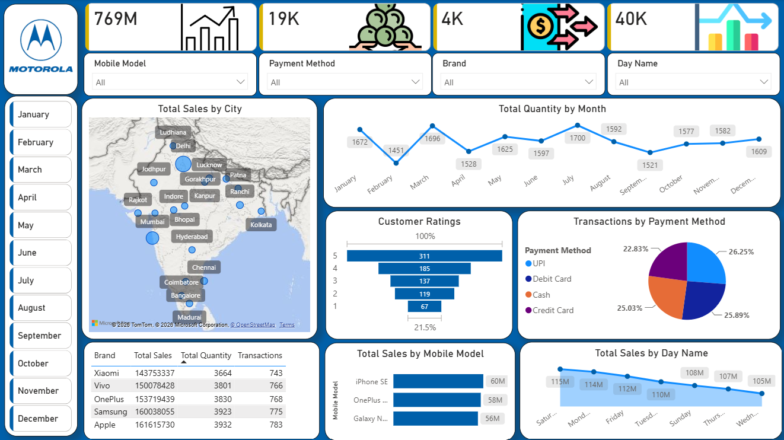

# Mobile Sales Dashboard – Power BI

## Overview
Interactive dashboard analysing mobile sales data.

## Tools Used
Excel, Power Query, Power BI, DAX

## Steps Done
1. Cleaned raw data
2. Transformed data in Power Query
3. Built the data model
4. Created visuals and KPIs

## Key Insights
1. Total Sales - 769M
2. Total Quantity - 19K
3. Total Transactions - 4K

## Dashboard Preview

## Files
- [Raw data](data/mobile_sales_data.xlsx) – Excel file
- [Final dashboard](dashboard/mobile_sales_dashboard.pbix) – Power BI file
